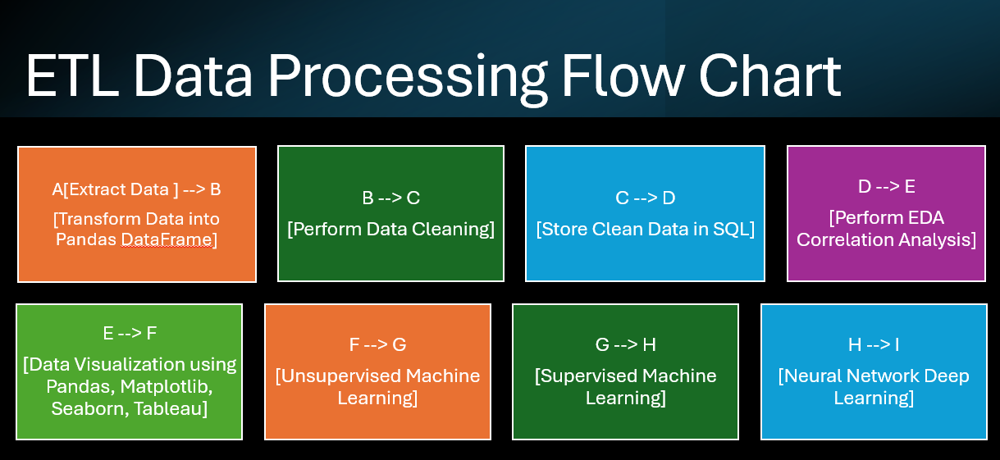
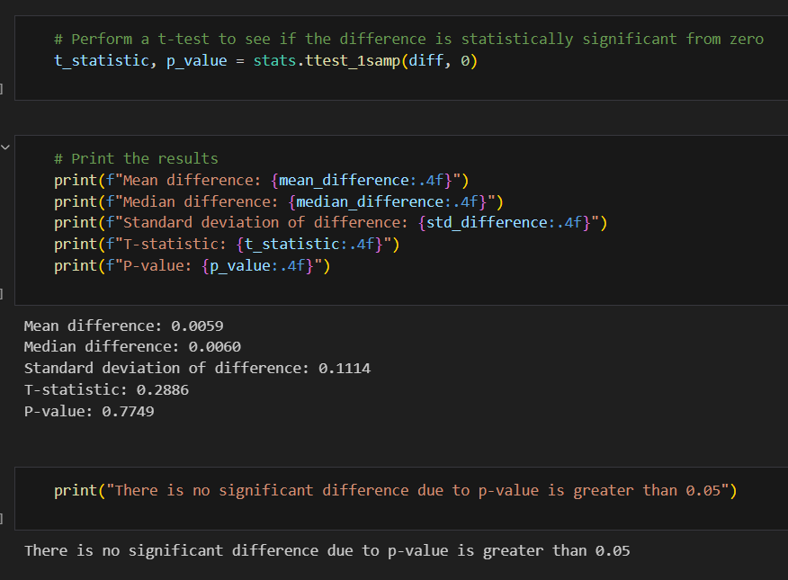
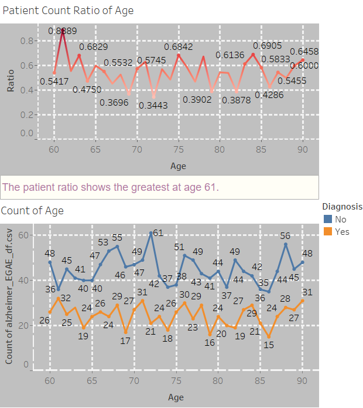
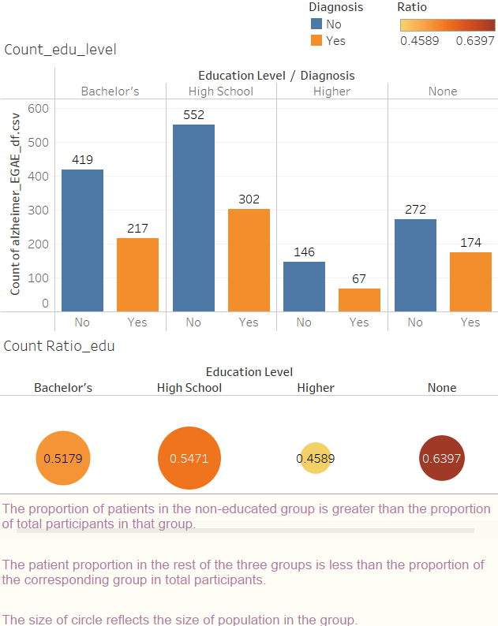
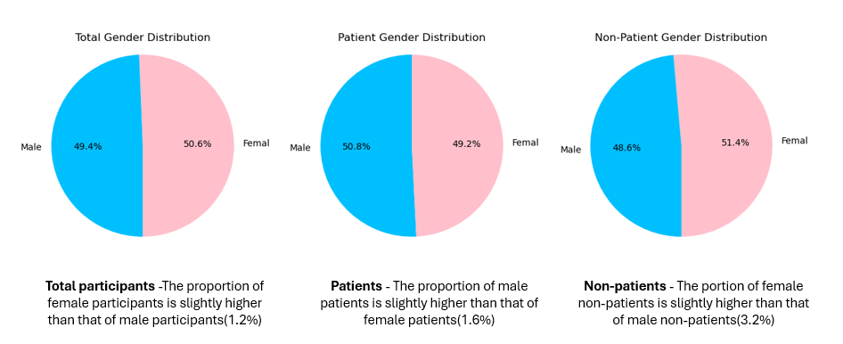
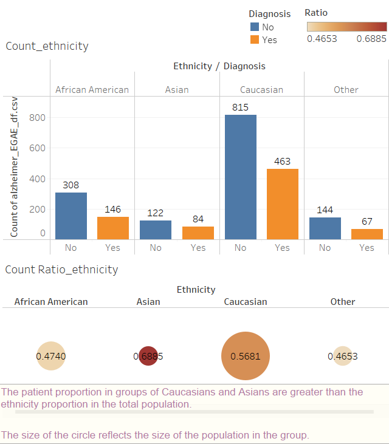
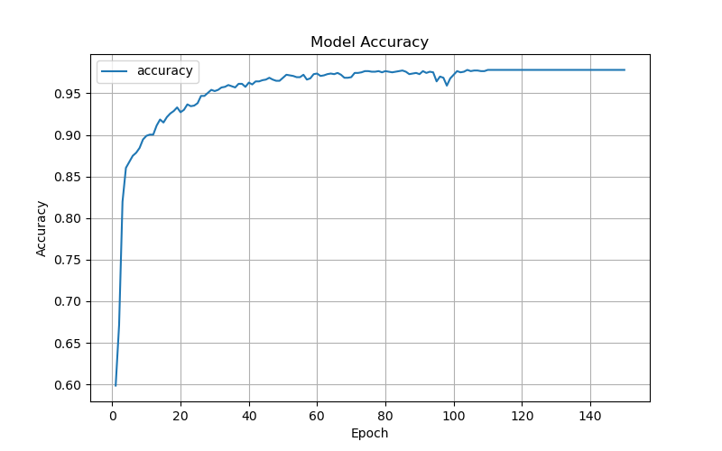

# Project-4-Team-2

### Sub-project Background

Alzheimer's Disease (AD) is a progressive neurodegenerative disorder that affects millions worldwide. Early diagnosis and understanding of the disease's progression are crucial for effective management. This project aims to leverage machine learning techniques to analyze a dataset containing patient information related to Alzheimer's Disease to identify key factors that contribute to the disease's onset and progression.

Dataset link: https://www.kaggle.com/datasets/rabieelkharoua/alzheimers-disease-dataset/data

In this sub-project, I focused on the category of demographic including gender, age, education, and ethnicity. However, through correlation analysis, five features in the category of Cognitive and Functional Assessments were only five diagnosis-correlated features. To enhance the accuarcy of the model, I decided to add the five diagnosis-correlated featuresthe to the four chosen demographic features for machine learning.

Data visualization on Tableau can be accessed through link: 

Tableau AD factor 
https://public.tableau.com/app/profile/yi.wen7753/viz/ADFactors/FactorsImpactonAD?

Tableau correlation
https://public.tableau.com/app/profile/yi.wen7753/viz/Corr_visual/Corr_diagnosis_features?publish=yes

### Table of Contents

* Resources folder containing oriignal dataset and part of the generated dataset

* Dataset in csv files and sql files

* Jyputer Notebook: 

Alzheimer_analysis_EDA_Visual.ipynb

Alzheimer_analysis_EDA_MLU.ipynb

Alzheimer_analysis_EDA_MLS.ipynb

Alzheimer_analysis_EDA_DL.ipynb

* Images of viusalization and machine learning results

### Flowchart 

### Observation

1. Correlation analysis

Only five Cognitive and Functional Assessments features show correlation with diagnosis based on the correlation matrix heatmap. 

2. Age analysis

No significant difference of patient proportion in each age group based on the t-test result. Note: limitation is that the age of all participants range from 60 to 90. The data with younger participants is absence. 

However, the patient ratio at 61 is the highest among all age groups. 

3. Eudcation level analysis

Patient ratio in non education group is the highest among all education levels. patient ratio in high school and Bachlor's degree are similar.
partient ratio in the higher education group is the lwoest.

4. Gender analysis

Patient ratio in female is slightly lower than male.
Non-patient ratio in female is slightly higher than male.

5. Ethnicity analysis

Patient ratio in Asian and Caucasian groups are the higher than African American and other groups.

6. Machine learning 

6.1. Unsupervised learning

K-means clustering, Elbow method and PCA was applied to analysis.

6.2. Supervised learning

Logistic regression and Random forest were applied to analysis. The results with and without the five diagnosis-correlated features are compared. The accuarcy of the model with the five diagnosis-correlated features is higher than the model without the five diagnosis-correlated features especially by Random Forest modeling. 

6.3. Deep learning

Neuron network through  TensorFlow was applied to analysis. The result was optimized by changing hidden layers, number of nodes, and epoach. The accuracy of the modeling is about 86%.

### Conclusion
This sub-project aims to identify key factors focusing on age, gender, education level, ethnicity that contribute to the onset and progression of Alzheimer's Disease. Due to limitation of the dataset, there is no significant difference of patient ratio among age groups. Only five Cognitive and Functional Assessments features show correlation with diagnosis. 

